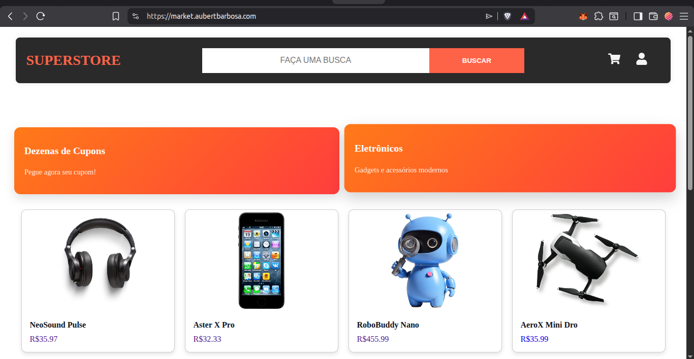
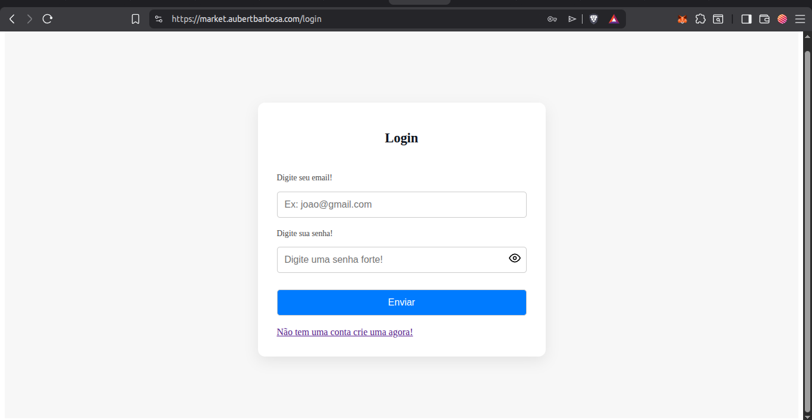
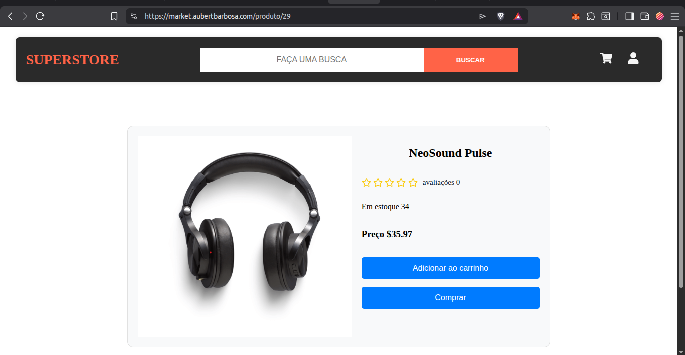
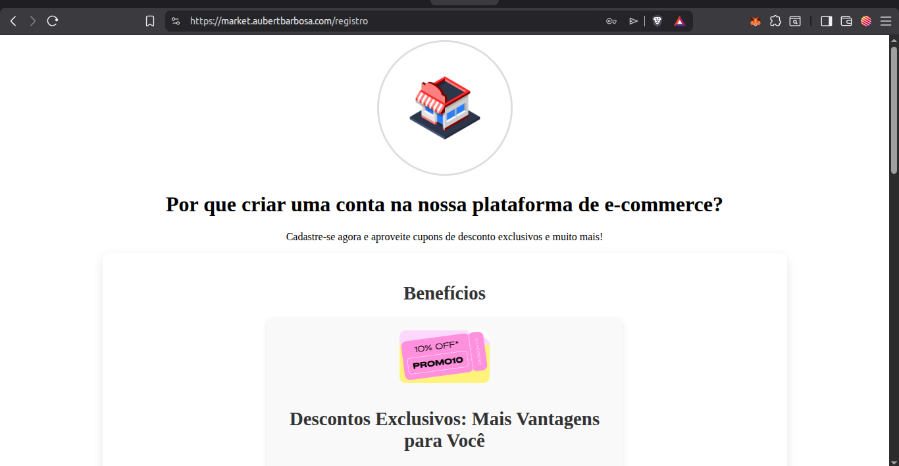
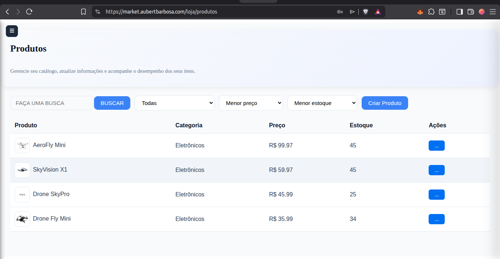
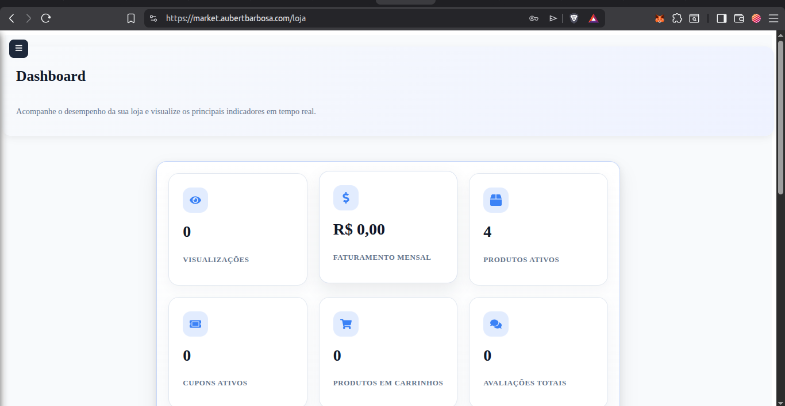
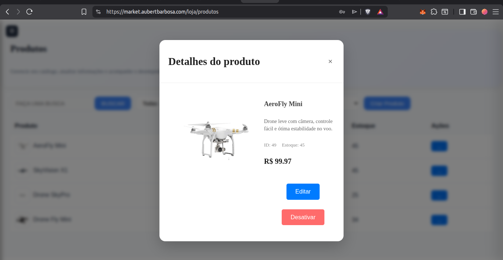
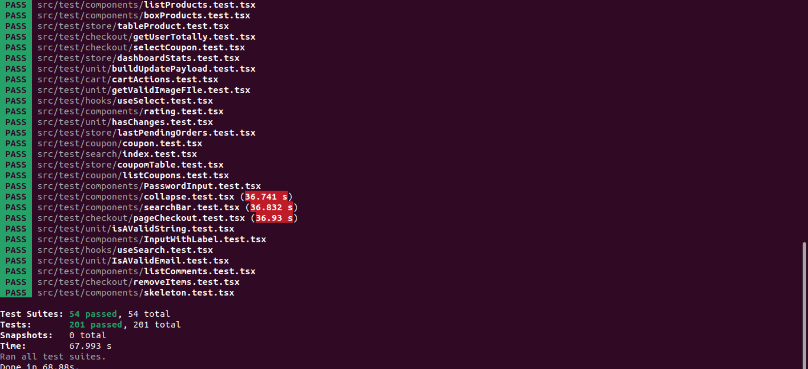

# SuperStore Frontend

Frontend de um marketplace desenvolvido com React e TypeScript. A aplicação permite pesquisar produtos, gerenciar carrinho e cupons, realizar compras e administrar lojas, produtos e pedidos.

## Aplicação online

O frontend da SuperStore está disponível online e pode ser acessado pelo link abaixo:

[Acessar aplicação](https://market.aubertbarbosa.com/)

A aplicação foi hospedada utilizando um bucket do Amazon S3 para armazenamento dos arquivos estáticos gerados pelo build. A Cloudflare foi utilizada para gerenciamento do domínio, DNS, HTTPS e entrega do conteúdo aos usuários.

## Demonstração

### Página inicial




---

### Login




---

### Detalhes do produto





---

### Registro de user




---

### Administração de produtos da loja




---

### Dashboard da loja





---

### Gerenciamento de produtos





### Tests automatizados



## Funcionalidades

### Usuário

* Registro e login
* Pesquisa e filtragem de produtos
* Visualização de detalhes do produto
* Carrinho de compras
* Aplicação de cupons
* Finalização de pedidos
* Consulta de pedidos e cupons

### Loja

* Criação de loja
* Dashboard administrativo
* Cadastro e gerenciamento de produtos
* Criação e gerenciamento de cupons
* Visualização de pedidos
* Controle de estoque

## Tecnologias

* React
* TypeScript
* Vite
* React Router
* Styled Components
* Cypress
* Jest
* React Testing Library

## Testes

O frontend possui testes unitários, testes de componentes, testes de hooks e testes End-to-End para validar regras isoladas e fluxos completos da aplicação.

### Testes unitários e de componentes

Os testes unitários validam componentes, hooks, serviços e comportamentos específicos da interface.

Principais áreas cobertas:

* Componentes de busca
* Hooks de pesquisa e filtros
* Dashboard da loja
* Estatísticas e dados administrativos
* Renderização condicional
* Tratamento de estados de erro
* Interações do usuário
* Chamadas aos serviços da aplicação

Tecnologias utilizadas:

* Jest
* React Testing Library
* TypeScript

Para executar os testes:

```bash
yarn test
```

Para executar em modo de observação:

```bash
yarn test --watch
```

Para gerar o relatório de cobertura:

```bash
yarn test --coverage
```

Os arquivos de teste estão organizados em:

```text
src/test/
├── components/
├── hooks/
├── services/
└── store/
```

---

### Testes End-to-End

Os testes E2E foram desenvolvidos com Cypress e simulam fluxos completos do usuário, integrando frontend, backend, autenticação e banco de dados de teste.

Principais fluxos cobertos:

* Registro de usuário
* Login
* Busca e filtros de produtos
* Visualização de produtos
* Adição de produtos ao carrinho
* Atualização da quantidade no carrinho
* Remoção de produtos
* Acesso de usuário não autenticado
* Adição e visualização de cupons
* Finalização de compra
* Criação de loja
* Gerenciamento de produtos
* Gerenciamento de cupons da loja
* Visualização de pedidos da loja

Para abrir a interface do Cypress:

```bash
yarn cypress open
```

Para executar os testes no terminal:

```bash
yarn cypress run
```

Os testes utilizam comandos personalizados para preparar o ambiente, incluindo:

```text
cy.reset_mocks()
cy.register_login()
cy.login()
cy.createStore()
```

Esses comandos permitem limpar os dados de teste, registrar usuários, autenticar sessões e criar lojas antes dos cenários.

A documentação detalhada dos testes E2E está disponível em:

```text
docs/tests
```

Cada documento apresenta:

* Objetivo do teste
* Cenários cobertos
* Resultados esperados
* Fluxo executado
* Pré-requisitos
* Tratamento de erros
